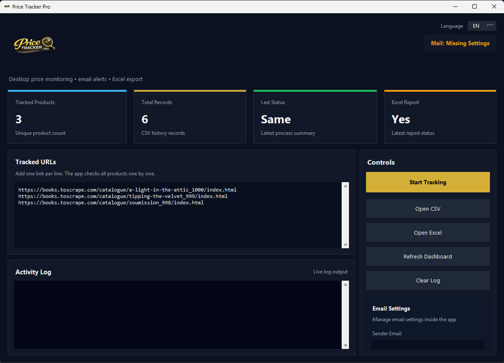

# Price Tracker Pro


A desktop price monitoring application with automated email alerts, Excel export and multilingual support.

Designed to reduce manual price checking and automate recurring monitoring workflows.



## Features

- **Multi-product tracking**: paste any number of product URLs, one per line, and check them all in one run
- **Email alerts on price drops**: get an email with the old price, the new price and the link as soon as a price falls
- **Excel reports**: styled `.xlsx` export with a history sheet, a summary sheet and color-coded price status
- **Price history**: every check is stored in CSV, so you can see how prices change over time
- **Live dashboard**: tracked products, total records, last status and report status at a glance
- **Multilingual UI**: switch between English and Turkish from inside the app
- **In-app email settings**: configure SMTP and send a test email without touching any code

## Tech Stack

- Python, Tkinter (desktop UI)
- Requests, BeautifulSoup, lxml (data collection)
- Pandas, OpenPyXL (CSV history and Excel reports)
- smtplib (email alerts)

## Installation

```bash
git clone https://github.com/GoodoldHuxton/price-tracker-pro.git
cd price-tracker-pro
pip install -r requirements.txt
```

## Usage

1. Start the app:
   ```bash
   python gui.py
   ```
2. Paste the product URLs you want to monitor into **Tracked URLs**.
3. *(Optional)* Fill in **Email Settings** and click **Send Test Email**. With Gmail, use an [App Password](https://support.google.com/accounts/answer/185833).
4. Click **Start Tracking**. Results appear in the activity log; use **Open CSV** / **Open Excel** to see the reports.

Run it again later (or on a schedule with Windows Task Scheduler and `python app.py`) and you will be emailed whenever a price drops.

> The parser tries a list of common product-page selectors and `og:` / `product:price` meta tags, and comes preconfigured with demo URLs from [books.toscrape.com](https://books.toscrape.com). Supporting a new store is usually a matter of adding one or two selectors in `parser.py`. Always respect the terms of service of the sites you monitor.

## What problem it solves

Checking prices by hand is slow, easy to forget and impossible to keep doing every day. Price Tracker Pro turns it into a one-click (or fully scheduled) job:

- **Online sellers** keep an eye on competitor pricing
- **Buyers and resellers** catch price drops the moment they happen
- **Small businesses** get a ready-to-share Excel report instead of a messy spreadsheet

## Contact / Available for freelance work

Need a custom price tracker for your store, a scraper or another automation tool? I build small, practical tools like this one.

- 📧 [skyiest15@gmail.com](mailto:skyiest15@gmail.com)
- 💼 [LinkedIn](https://www.linkedin.com/in/yi%C4%9Fit-alp-bayar-96630b268)
